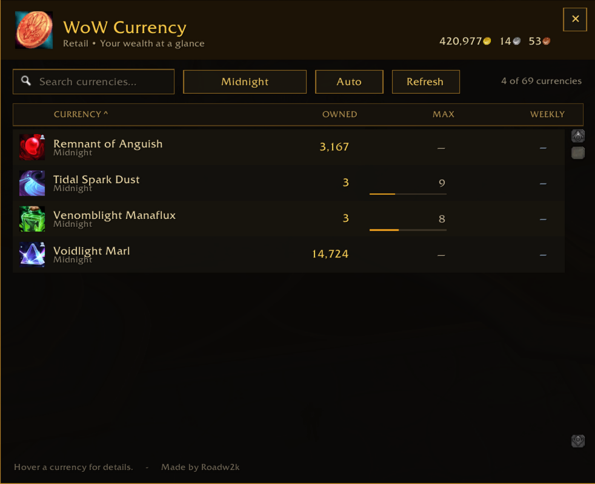

# WoW Currency

WoW Currency is a lightweight currency dashboard for Retail, Classic Era, and Mists of Pandaria Classic. 

## Screenshot




## Features

- Displays character gold on every supported client
- Lists currencies exposed by the current game client's currency API
- Searches currencies by name or category
- Manual mode filters currencies using one or more saved Blizzard categories
- Auto mode shows currency categories associated with the expansion zone you are currently in
- Sorts by currency name, amount owned, maximum, or weekly progress
- Shows caps, weekly progress, descriptions, currency IDs, and account-wide or transferable status when those details are supplied by the client
- Provides a movable minimap button and dashboard window
- Remembers window and minimap-button positions between sessions
- Uses only Blizzard UI assets and requires no external libraries

Classic Era does not provide the same currency-list API as Retail and MoP Classic, so the dashboard displays character gold there. Additional currencies and metadata vary by client and expansion.

## Supported clients

- Retail
- Classic Era
- Mists of Pandaria Classic

## Installation

1. Download or copy the addon into the selected WoW client's `Interface/AddOns` directory.
2. Make sure the final layout is:

   ```text
   Interface/AddOns/WoWCurrency/WowCurrency.toc
   Interface/AddOns/WoWCurrency/WoWCurrency.lua
   ```

3. Fully restart World of Warcraft if the addon was installed while the game was running. `/reload` does not discover newly installed addons.

## Usage

Left-click the minimap button to open or close the dashboard. Drag the button around the minimap to reposition it, or drag the dashboard to move the window. Right-click the minimap button to hide it.

Hover over a currency row to see the details available from the game client.

Use the **Manual/Auto** button beside the category filter to change modes:

- **Manual** — choose any combination of categories. The selection persists across logout and login.
- **Auto** — determines the current expansion from the zone's map ancestry and shows matching currency categories. For example, entering Outland selects Burning Crusade currency categories. In zones without a distinct expansion continent, Auto falls back to showing all categories.

Opening the category menu while Auto mode is active switches back to Manual mode so you can edit the saved selection.

## Commands

- `/wc` — toggle the dashboard
- `/wc minimap` — restore the minimap button after hiding it
- `/wc reset` — reset the window and minimap-button positions
- `/wc help` — print the command list
